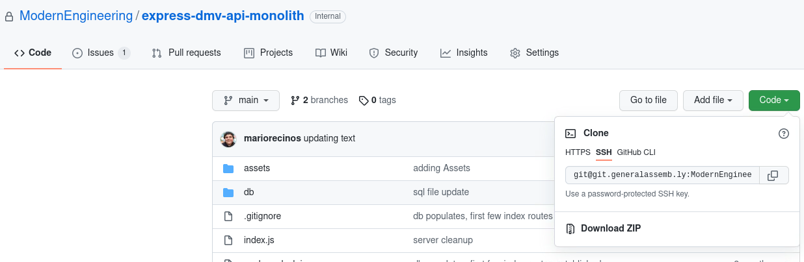

# DMV Express API

## Clone This Repository To Your Local Machine

1. `cd` into your `mef` folder run the command:
   ```
   cd mef
   ```
2. Go to the `code` green icon and select ssh.  Then click on the clipboard icon to copy the url

   

3. Inside of your terminal enter the command

   ```bash
   git clone git@git.generalassemb.ly:ModernEngineering/express-dmv-api-monolith.git
   ```

4. `cd` into the `express-dmv-api-monolith` directory run the command:
   ```bash
      cd express-dmv-api-monolith/
   ```


## Fixing PostgreSQL Authentication Error

To resolve a PostgreSQL authentication error by setting the authentication method to `md5`, follow these steps:

1. **Open `pg_hba.conf` for Editing**:
   In the terminal, run:

   `sudo code /var/lib/pgsql/data/pg_hba.conf --user-data-dir='.' --no-sandbox`

   This command opens the `pg_hba.conf` file in vs code editor with superuser privileges.

2. **Update pg_hba.conf file**:
- Inside the vs code editor copy and paste below the **Put Your Actual Configuration Here.**  Section


   ```sql
   # TYPE  DATABASE        USER            ADDRESS                 METHOD

   host                all        postgres   127.0.0.1/32   md5
   local               all        postgres                  md5
   host                all        all        0.0.0.0/0      md5
   host                all        all        localhost      md5


   # "local" is for Unix domain socket connections only
   local   all             all                                     md5
   # IPv4 local connections:
   host    all             all             127.0.0.1/32            ident
   # IPv6 local connections:
   host    all             all             ::1/128                 ident
   ```

5. **Save and Exit**:
   - Go to File on the top right of vs code and select save.

6. **Restart PostgreSQL**:
- Restart the PostgreSQL service to apply changes:

   - `sudo systemctl restart postgresql`

   


Now, PostgreSQL will use `md5` authentication for the `postgres` user.

## Installation Instructions

Create a postgresql database named `dmv_app_db` owned by the `postgres` user. Use the password `postgres`.

*in the terminal enter the commands*
```
createdb dmv_app_db -U postgres
```
### Receiving Authentication Failed Message?

* Make sure that you have spelled the password correct which should be **postgres**

Execute the `db/initialize.sql` file to populate the local database.

```
psql -U postgres dmv_app_db < db/initialize.sql
```

Run `npm install` to install node_modules, and `npm start` to start the app.
If you get a message that a port is in use, you can kill it with this command: `sudo kill -9 $(sudo lsof -t -i:3001)`

## API Endpoints

This API uses standard REST convention endpoints for the following resources:

1. Drivers
1. Plates
1. Makes
1. Models

For example, the following routes are available for drivers:

| Request Method     | Request URL | Result |
| ----------- | ----------- | ----------- |
| GET      | /api/drivers       | A JSON array of all drivers |
| GET      | /api/drivers/:driverId       | The driver with the specified id |
| POST      | /api/drivers       | A new driver is created |
| PUT      | /api/drivers/:driverId       | The driver with the specified id is updated |
| DELETE     | /api/drivers/:driverId       | The driver with the specified id is deleted |

There is also a special **nested** resource route, allowing users to query for all models belonging to a given make:

`/api/makes/:makeId/models` will send all models belonging to the make with the specified makeId.

## Sending Requests with Body

When making CREATE or UPDATE requests, be sure to send your data in the request body with JSON encoding.
