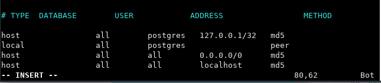
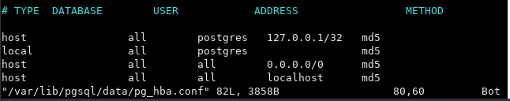
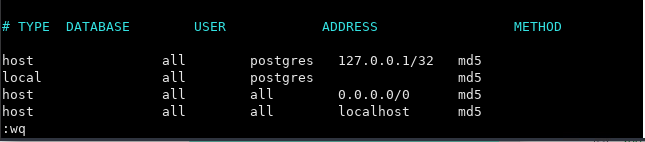
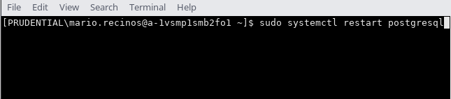

# DMV Express API

## Fixing PostgreSQL Authentication Error

To resolve a PostgreSQL authentication error by setting the authentication method to `md5`, follow these steps:

1. **Open `pg_hba.conf` for Editing**:
   In the terminal, run:

   `sudo vi /var/lib/pgsql/data/pg_hba.conf`
   <br>

   This command opens the `pg_hba.conf` file in vi editor with superuser privileges.

2. **Enter Insert Mode**:
   - Press `i` to enter insert mode in vi, which allows you to make changes to the file.

   

3. **Edit Authentication Method**:
   - Find the line corresponding to the `postgres` user, typically:
   ```
   local   all   postgres   peer
   ```
   

- Change `peer` to `md5`:
  ```
  local   all   postgres   md5
  ```
  

4. **Save and Exit**:
   - Press `Esc` to exit insert mode and return to command mode.
   - Type `:wq` and then press `Enter` to save the changes and close the editor.

   

   <br>

5. **Restart PostgreSQL**:
Restart the PostgreSQL service to apply changes:

   - `sudo systemctl restart postgresql`

   


Now, PostgreSQL will use `md5` authentication for the `postgres` user.

## Installation Instructions

Create a postgresql database named `dmv_app_db` owned by the `postgres` user. Use the password `postgres`.


```
createdb dmv_app_db -U postgres
```
## Fixing PostgreSQL Authentication Error

* Make sure that you have spelled the password correct which should be **postgres**

Execute the `db/initialize.sql` file to populate the local database.

```
psql -U postgres dmv_app_db < db/initialize.sql
```

Run `npm install` to install node_modules, and `npm start` to start the app.
If you get a message that a port is in use, you can kill it with this command: `sudo kill -9 $(sudo lsof -t -i:3001)`

## API Endpoints

This API uses standard REST convention endpoints for the following resources:

1. Drivers
1. Plates
1. Makes
1. Models

For example, the following routes are available for drivers:

| Request Method     | Request URL | Result |
| ----------- | ----------- | ----------- |
| GET      | /api/drivers       | A JSON array of all drivers |
| GET      | /api/drivers/:driverId       | The driver with the specified id |
| POST      | /api/drivers       | A new driver is created |
| PUT      | /api/drivers/:driverId       | The driver with the specified id is updated |
| DELETE     | /api/drivers       | The driver with the specified id is deleted |

There is also a special **nested** resource route, allowing users to query for all models belonging to a given make:

`/api/makes/:makeId/models` will send all models belonging to the make with the specified makeId.

## Sending Requests with Body

When making CREATE or UPDATE requests, be sure to send your data in the request body with JSON encoding.
